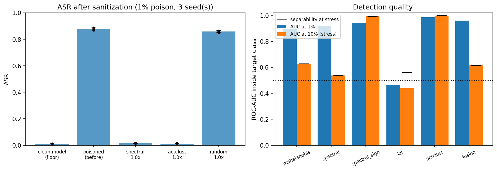

# fast-poison-finder

Detecting and removing poisoned training samples from a backdoored CIFAR-10 classifier, with controlled comparisons of five detectors across three seeds.

**Headline result.** A blended-trigger backdoor implanted with 500 poisoned images (1% of the training set) reaches 88% attack success rate (ASR) on a ResNet-18. Removing the samples flagged by either spectral signatures or activation clustering, then retraining from scratch, brings ASR down to about 1.3% to 1.5%. The ASR of a clean model on the same triggered inputs is 1.0%. Clean accuracy is unchanged. Removing the same number of random target-class samples leaves ASR at 85.8%.

This is an evaluation of known defenses against a standard attack in one setting. It does not propose a new method. See [Limitations](#limitations) before drawing conclusions from the numbers.



## Setup

**Attack (dirty-label poisoning).** 500 images (1% of the 50,000 training images) are drawn only from non-target classes. Each gets a blended white 5x5 square in the bottom-right corner (alpha 0.6) and its label is changed to the target class 0 (airplane). The target class then holds 5,500 training images and 9.1% of them are poison. A stress setting uses 5,000 poisons (10%), which makes poison 50% of the target class.

**Model.** ResNet-18 with a CIFAR-style stem (3x3 stride-1 conv and no max-pool). SGD with Nesterov momentum, one-cycle learning rate with peak 0.1, weight decay 5e-4, batch size 256, 15 epochs, random crop and horizontal flip, mixed precision. The clean model reaches 91.76% test accuracy.

**Defender assumptions.**
- The defender trained on the poisoned data and uses the 512-d penultimate-layer activations of that poisoned model as features.
- The defender knows which class is the attack target. All detectors score samples inside that class only.
- For sanitization the removal budget k is set to a multiple of the true poison count (1.0x means k equals the number of poisons). This assumes the defender knows how many poisons exist, which is an oracle assumption.

**Detectors** (each outputs a suspicion score per target-class sample):

| Name | Description |
|---|---|
| `mahalanobis` | Mahalanobis distance to the class mean with a shrunk covariance |
| `spectral` | Spectral signatures (Tran et al. 2018): squared projection on the top singular vector of the centered class features |
| `spectral_sign` | Same singular vector but ranked by signed position, oriented toward the side with fewer samples |
| `lof` | Local Outlier Factor (20 neighbors) |
| `actclust` | Simplified activation clustering (Chen et al. 2018): PCA to 10 dimensions, 2-means, flag the smaller cluster |
| `fusion` | Mean rank of `mahalanobis` and `spectral` |

**Metrics.** ASR is measured on triggered test images whose true class is not the target. Detection AUC and average precision (AP) are computed inside the target class. `sep` is max(AUC, 1 minus AUC): a label-aware diagnostic of how separable the poison is whatever side a detector flags. It is not a defense result.

## Results

All numbers come from `results_v3/results_v3.json`. Main experiment: 3 seeds. Stress test: seed 0 only.

### Sanitization at 1% poison (retrain from scratch after removing k = 500 samples)

| Condition | Poison removed | Clean accuracy | ASR (mean) | ASR per seed |
|---|---|---|---|---|
| Clean model (floor) | n/a | 0.9176 | 0.0104 | n/a |
| Poisoned model, no defense | 0 | 0.9151 | 0.8781 | n/a |
| Spectral signatures | 398/500 | 0.9158 | 0.0149 | 0.0138, 0.0151, 0.0159 |
| Activation clustering | 452/500 | 0.9156 | 0.0128 | 0.0126, 0.0126, 0.0132 |
| Random removal (control) | 43/500 | 0.9131 | 0.8584 | 0.8596, 0.8514, 0.8641 |

### Detection inside the target class at 1% poison (chance AP 0.091)

| Detector | AUC (mean +- std) | AP | Recall at 1.0x | Recall at 2.0x |
|---|---|---|---|---|
| actclust | 0.986 +- 0.01 | 0.953 | 0.905 | 0.959 |
| fusion | 0.961 +- 0.01 | 0.822 | 0.734 | 0.895 |
| spectral_sign | 0.943 +- 0.03 | 0.887 | 0.831 | 0.891 |
| spectral | 0.921 +- 0.03 | 0.851 | 0.797 | 0.843 |
| mahalanobis | 0.894 +- 0.02 | 0.521 | 0.509 | 0.721 |
| lof | 0.465 +- 0.04 | 0.146 | 0.181 | 0.269 |

### Stress test at 10% poison (poison is 50% of the target class, seed 0 only, detection only)

| Detector | AUC | AP | Recall at 1.0x |
|---|---|---|---|
| actclust | 0.998 | 0.998 | 0.985 |
| spectral_sign | 0.995 | 0.997 | 0.983 |
| mahalanobis | 0.627 | 0.590 | 0.586 |
| fusion | 0.617 | 0.685 | 0.592 |
| spectral | 0.537 | 0.669 | 0.530 |
| lof | 0.438 | 0.474 | 0.453 |

Chance AP is 0.500 here. Recall at 2.0x is not reported because that budget covers the whole class.

## Findings

1. **Both cluster-aware defenses neutralize the backdoor at 1% poison** with no measurable accuracy cost. The random-removal control shows the drop comes from removing poison and not from removing data.
2. **ASR cannot rank activation clustering against spectral signatures at this budget.** Activation clustering has the lower ASR in all three seeds but by about 0.002. Both are within 0.5 points of the clean-model floor. The two differ in recall (0.905 versus 0.797). A leftover of roughly 50 to 100 poisons is too few to implant this trigger.
3. **Plain spectral scoring fails at 50% poison while the sign-aware version succeeds** (AUC 0.537 versus 0.995). Both use the same singular vector, so the squared projection discards the information that separates the clusters when the two groups are similar in size. This is a single-seed result.
4. **Mahalanobis and LOF are weak here.** LOF is uninformative at 1% (AUC 0.465 +- 0.04). Mahalanobis separates poorly at the top of the ranking (AP 0.521).
5. **Rank fusion raises AUC but lowers precision at the top** (recall at 1.0x of 0.734 versus 0.797 for spectral alone), so the fusion row should not be read as an improvement.

## Limitations

- **Orientation is unresolved at high poison rates.** `actclust` and `spectral_sign` flag the smaller side. At 50% poison the sides are close in size (4,686 versus 5,314 and 4,716 versus 5,284), so the choice is nearly arbitrary. Both picked the poison side in this run (`sep` equals AUC). A deployable rule would need an anchor such as a small trusted set of clean samples. The stress result shows that one direction separates the poison and does not show that a deployable rule detects it.
- **The stress test has one seed and no sanitization step.** No end-to-end claim is made at 10% poison.
- **Oracle assumptions:** known target class and a removal budget set from the true poison count.
- **One attack and one setting:** a single blended trigger (alpha 0.6, 5x5, bottom-right), ResNet-18, CIFAR-10, 15 epochs. An alpha of 0.2 at 1% poison did not implant a backdoor under this training recipe (ASR 0.055 in an earlier run). Results for subtler triggers or other datasets are not covered.
- **Run-to-run noise.** Training is not bit-deterministic. The same seed produced 414 and 399 poisons caught by spectral signatures in two separate runs, so recall differences of a few points are within noise.
- **Features come from the poisoned model.** A defender without the poisoned model's activations would need a different feature source.
- **Activation clustering is a simplified variant** (PCA instead of ICA and no cluster-quality test).

## Reproducing

Requirements: Python 3, PyTorch, torchvision, scikit-learn, scipy, numpy and matplotlib. The reported runs used torch 2.5.1 with CUDA 12.1 on an NVIDIA RTX 4060 laptop GPU with 8 GB of memory. CIFAR-10 is downloaded automatically.

```
pip install torch torchvision scikit-learn scipy numpy matplotlib
```

1. Open `FastPoisonFinder_v3.ipynb` and run the cells in order. `PRESET = "full"` runs seeds 0, 1 and 2 and `"quick"` runs seed 0 only.
2. Training takes about 11.4 minutes per model on the hardware above. The full preset trains 16 models (about 3 hours). The quick preset trains 6 models.
3. Each finished trial and student is saved to `results_v3/`, so rerunning the run cell resumes after an interruption. Changing the config invalidates saved files whose settings differ.
4. The notebook stops with an error if the poisoned model's ASR is below 0.5, because detection results would be meaningless without an implanted backdoor. A pilot cell (off by default) can be used to tune the trigger.

## Repository contents

| Path | Contents |
|---|---|
| `FastPoisonFinder_v3.ipynb` | Full pipeline with saved outputs |
| `results_v3/results_v3.json` | Aggregated results behind every table above |
| `results_v3/trial_*.json` and `scores_*.npz` | Per-trial metrics and per-sample detector scores |
| `results_v3/v3_summary.png` | Summary figure |

## References

- Tran, Li and Madry. *Spectral Signatures in Backdoor Attacks.* NeurIPS 2018.
- Chen et al. *Detecting Backdoor Attacks on Deep Neural Networks by Activation Clustering.* AAAI SafeAI Workshop 2019.
- Gu, Dolan-Gavitt and Garg. *BadNets: Identifying Vulnerabilities in the Machine Learning Model Supply Chain.* 2017.
- Chen et al. *Targeted Backdoor Attacks on Deep Learning Systems Using Data Poisoning.* 2017.
